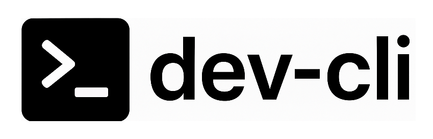
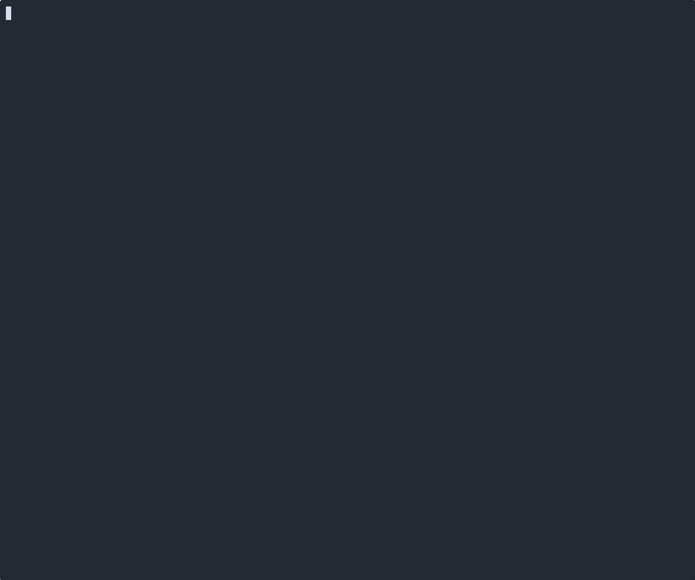

<div align="center">



**Effortless project navigation for the terminal**

[](https://github.com/csvenke/dev-cli/releases)
[](https://github.com/csvenke/dev-cli/actions)

</img>

</div>

## Requirements

- Any [nerd font](https://www.nerdfonts.com/) for icons

## Installation

### Binary releases

For Windows, macOS 12 or newer, or Linux, you can download a binary release [here](https://github.com/csvenke/dev-cli/releases)

### Nix

#### nix profile

```bash
nix profile add github:csvenke/dev-cli
```

#### nix flake

```nix
{
  description = "your flake";

  inputs = {
    nixpkgs.url = "github:NixOS/nixpkgs/nixos-unstable";
    dev-cli = {
      url = "github:csvenke/dev-cli";
      inputs.nixpkgs.follows = "nixpkgs";
    };
  };
}
```

## Usage

Make sure `$EDITOR` is set to your preferred editor (e.g., `nvim`)

```bash
dev
```

### Specifying project paths

By default, `dev` searches for git repositories recursively starting from your home directory (`$HOME`).
You can customize the search paths in two ways:

**1. Environment variable**

```bash
export DEV_PATHS="~/repos/personal ~/repos/work"
```

**2. Command-line arguments**

```bash
dev ~/specific/project-group ~/another/folder
```

## License

MIT
