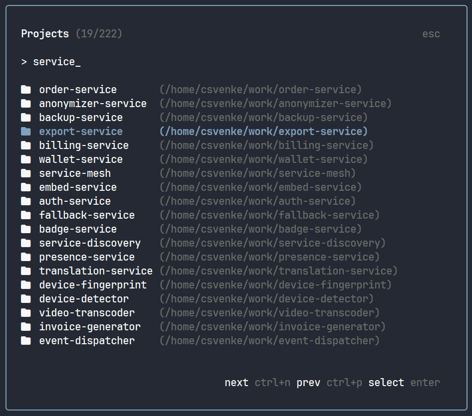

<div align="center">

<h1>dev-cli</h1>

**Fuzzy multiplexer-aware project picker**

[](https://github.com/csvenke/dev-cli/releases)
[](https://github.com/csvenke/dev-cli/actions)

</img>

</div>

## Installation

Coming soon

## Usage

```bash
dev
```

### Configuration

```bash
export DEV_PATHS="~/repos/personal ~/repos/work"
export EDITOR="nvim"
```

### Multiplexer integration

When running inside `tmux` or `zellij`, dev automatically renames the current window/tab to the project name

## License

MIT
